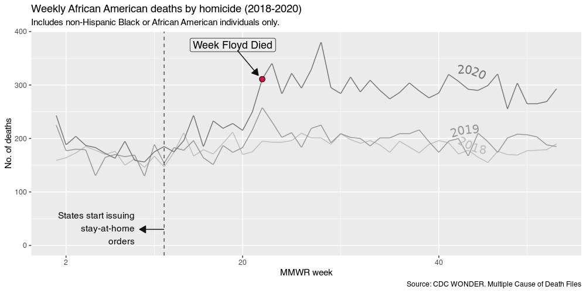
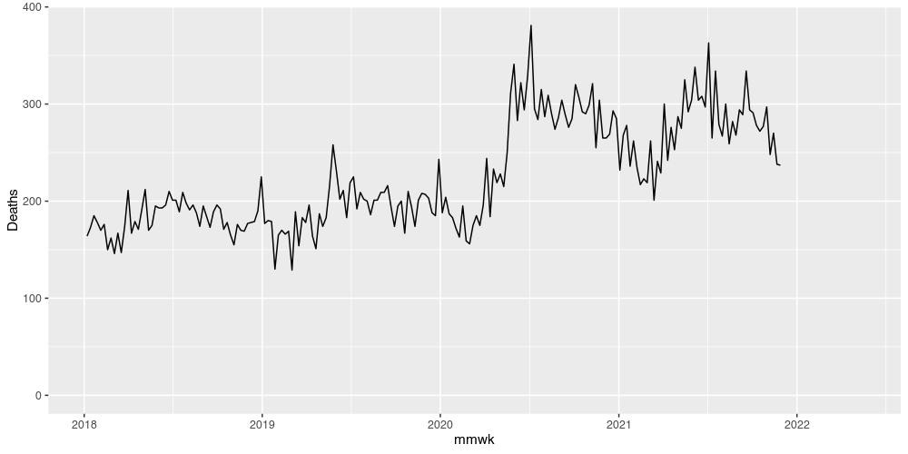
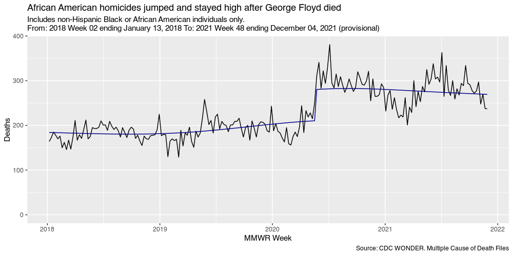

```r
# wonder_url_mcod18 <- tothewonder:::session_mcd_provisional()
```


```r
library(ggplot2)
library(tidyverse)
library(RColorBrewer)
library(geomtextpath)
library(lubridate)
library(MMWRweek)
library(tothewonder)


df <- mcd_provisional(wonder_url = wonder_url_mcod18,
                       group_by_1 = "MMWR Week",
                       group_by_2 = "None",
                       group_by_3 = "None",
                       group_by_4 = "None",
                       show_confidence_interval = FALSE,
                       show_standard_error = FALSE,
                       age = "All Ages",
                       period_option = "MMWR",
                       period = 2018:2022,

                       residence_fips = "All",
                       residence_urbanization_year = c("2013"),
                       residence_urbanization = "All Categories",
                       occurrence_fips = "All",
                       occurrence_urbanization_year = c("2013"),
                       occurrence_urbanization = "All Categories",

                       weekday = c("All Weekdays"),
                       autopsy = c("All Values"),
                       place_of_death = c("All Places"),
                       gender = c("All Genders"),
                       hispanic_origin = "Not Hispanic or Latino",
                       race_option = "Single Race 6",
                       race = "Black or African American",
                       ucd_option = "Injury Intent and Mechanism",
                       ucd_injury_intent = "Homicide",
                       ucd_injury_mechanism = "All Causes of Death",
                       mcd_option = "MCD - ICD-10 Codes",
                       mcd_icd_codes = "All",
                       mcd_icd_codes_and = "All")
```


```r
df <- df |>
  dplyr::filter(Notes != "Total") |>
  na.omit() |>
  mutate(week = str_replace(MMWR.Week.Code, "[0-9]{4}/([0-9]{2})", "\\1")) |>
  mutate(year = str_replace(MMWR.Week.Code, "([0-9]{4})/[0-9]{2}", "\\1")) |>
  mutate(week = as.numeric(week)) |>
  # get rid of weeks with value 99
  dplyr::filter(week < 99) |>
  mutate(Deaths = as.numeric(Deaths)) |>
  mutate(mmwk = MMWRweek2Date(MMWRyear = as.numeric(str_sub(MMWR.Week.Code, 1, 4)),
                              MMWRweek =  as.numeric(str_sub(MMWR.Week.Code, 6, 7)))) |>
  dplyr::filter(week != 99) # |>
#> Warning in mask$eval_all_mutate(quo): NAs introduced by coercion
  # dplyr::filter(year != 2021)
```


```r
# California became the first state to order residents to stay home unless engaged in essential activities. Gov. Gavin Newsom (D) issued the order on March 19, 2020.
# week 12
ggplot(dplyr::filter(df, year <= 2020), aes(week, Deaths, group = year,  color = year)) +
  geom_textline(aes(label = year),
                vjust = -.5,
                size = 5, hjust = 0.85, text_smoothing = 95,
                fontface = 2,
                family = "SF Display Pro",
                show.legend = FALSE) +
  scale_color_discrete(guide = FALSE) +
  scale_color_manual(values = brewer.pal(n = 9, name = "Greys")[4:8],
                     labels = c(2018:2021),
                     breaks = c(2018:2021)) +
  geom_vline(xintercept = 12, linetype = 2, alpha = .7) +
  annotate("text", x = 9, y = 32, label = "States start issuing\nstay-at-home\norders",
           hjust = 1) +
  geom_line(data = data.frame(Deaths = c(30, 30), week = c(12, 9.5), year = NA),
            color = "#111111",
            arrow = arrow(length=unit(0.30,"cm"), ends= "first", type = "closed"),
            show.legend = FALSE) +
  geom_point(data = subset(df, week == 22 & year == 2020),
             fill = "#d11141", size = 2.9, color = "black", shape = 21) +
  scale_fill_discrete(guide="none") +
  xlab("MMWR week") +
  ylab("No. of deaths") +
  labs(title ="Weekly African American deaths by homicide (2018-2020)",
       subtitle = "Includes non-Hispanic Black or African American individuals only.",
       caption = "Source: CDC WONDER. Multiple Cause of Death Files") +
  annotate("label", x = 19, y = 375, label = "Week Floyd Died",
           fill = "#eeeeee", size = 4.5) +
  geom_line(data = data.frame(Deaths = c(364, 318), week = c(19.5, 21.6), year = NA),
            color = "#111111",
            arrow = arrow(length=unit(0.30,"cm"), ends= "last", type = "closed"),
            show.legend = FALSE) +
  expand_limits(y = 0) +
  scale_x_continuous(breaks = c(2, 20, 40),
                     limits = c(1, 52))
#> Scale for 'colour' is already present. Adding another scale for 'colour',
#> which will replace the existing scale.
#> Warning: Removed 1 rows containing missing values (geom_text_line).
```




```r
## Data starts on Monday January 1, 2018. Since MMWRs start on Sunday the first MMWR is missing one day
df <- df[2:nrow(df), ]

ggplot(df, aes(mmwk, Deaths)) +
  geom_line() +
  expand_limits(y = 0)
#> Warning: Removed 24 row(s) containing missing values (geom_path).
```




```r
library(splines)
library(mgcv)
library(gratia)

df <- df[!is.na(df$Deaths), ]
df$date_numeric <- as.numeric(df$mmwk)
df$log_deaths <- log(df$Deaths)
df$blm <- if_else(df$mmwk >= "2020-05-24", TRUE, FALSE)


mod_lm <- gam(Deaths ~ s(date_numeric, k = 6) + s(week, bs = "cc", k = 52) +
                blm, data = df, family = poisson(link = log))
summary(mod_lm)
#> 
#> Family: poisson 
#> Link function: log 
#> 
#> Formula:
#> Deaths ~ s(date_numeric, k = 6) + s(week, bs = "cc", k = 52) + 
#>     blm
#> 
#> Parametric coefficients:
#>             Estimate Std. Error z value Pr(>|z|)    
#> (Intercept)  5.28083    0.01296 407.388   <2e-16 ***
#> blmTRUE      0.28690    0.03028   9.475   <2e-16 ***
#> ---
#> Signif. codes:  0 '***' 0.001 '**' 0.01 '*' 0.05 '.' 0.1 ' ' 1
#> 
#> Approximate significance of smooth terms:
#>                    edf Ref.df Chi.sq p-value    
#> s(date_numeric)  3.856  4.493   66.6  <2e-16 ***
#> s(week)         16.425 50.000  275.7  <2e-16 ***
#> ---
#> Signif. codes:  0 '***' 0.001 '**' 0.01 '*' 0.05 '.' 0.1 ' ' 1
#> 
#> R-sq.(adj) =  0.874   Deviance explained = 88.8%
#> UBRE = 0.62008  Scale est. = 1         n = 204
df$predict <- predict(mod_lm, exclude = "s(week)")

# AIC(mod_lm)
# appraise(mod_lm)
# gam.check(mod_lm)
# summary(mod_lm)

ggplot(df, aes(mmwk, Deaths)) +
  geom_line() +
  geom_line(aes(mmwk, exp(predict)), color = "darkblue") +
  expand_limits(y = 0) +
  xlab("MMWR Week") +
  labs(title = paste0("African American homicides jumped and stayed high after George Floyd died"),
       subtitle = paste0("Includes non-Hispanic Black or African American individuals only.\n",
                         "From: ",  df$MMWR.Week[1],
                         " To: ", df$MMWR.Week[nrow(df)]),
       caption = "Source: CDC WONDER. Multiple Cause of Death Files")
```



```r
  geom_line(data = data.frame(Deaths = c(311, 331),
                              mmwk = c(as.Date("2020-05-25"),
                                       as.Date("2020-02-10"))),
            color = "#111111",
            arrow = arrow(length=unit(0.30,"cm"), ends= "first", type = "closed"),
            show.legend = FALSE) +
  geom_point(data = subset(df, week == 22 & year == 2020),
             fill = "#d11141", size = 2.9, color = "black", shape = 21) +
  annotate("label", x = as.Date("2019-10-30"), y = 331, label = "Week Floyd Died",
           fill = "#eeeeee", size = 4.5)
#> Error:
#> ! Cannot add ggproto objects together. Did you forget to add this object to a ggplot object?
```
