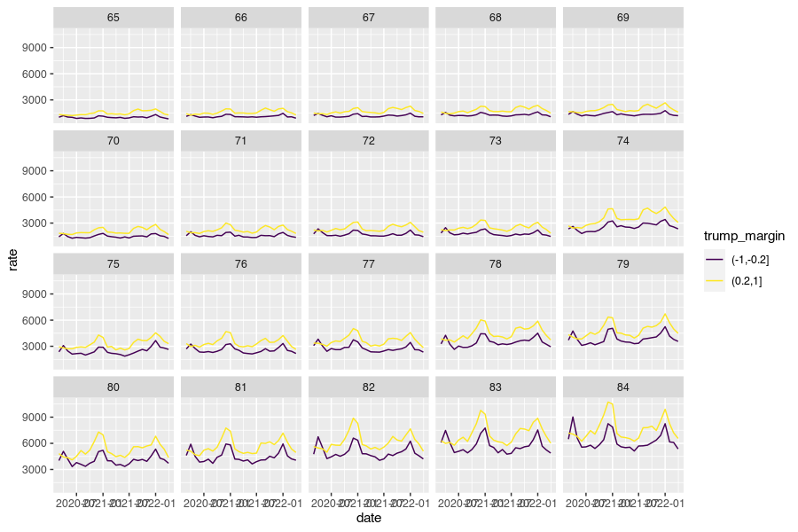
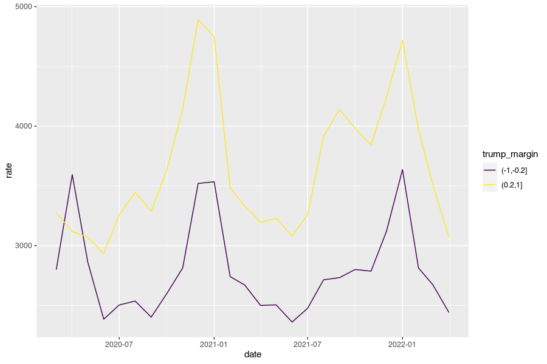
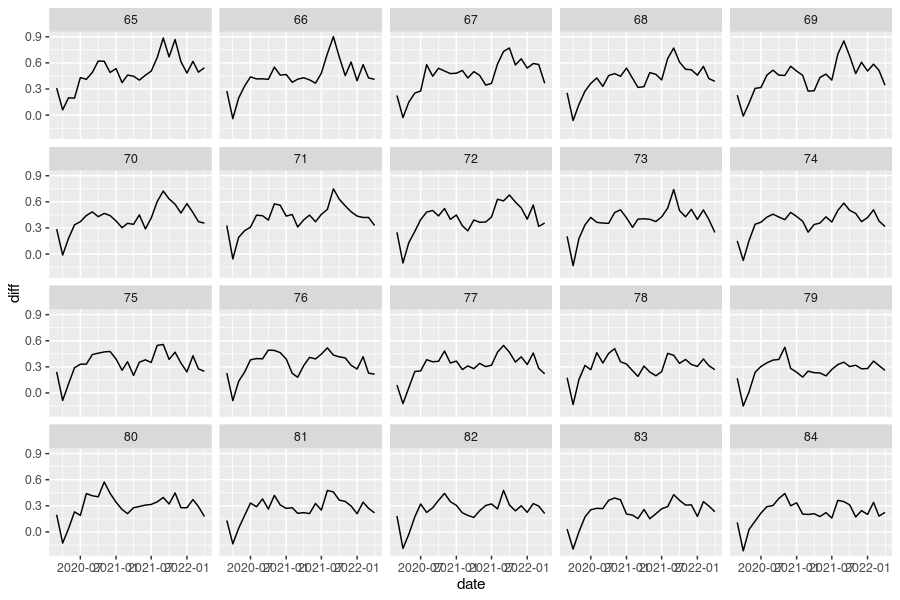
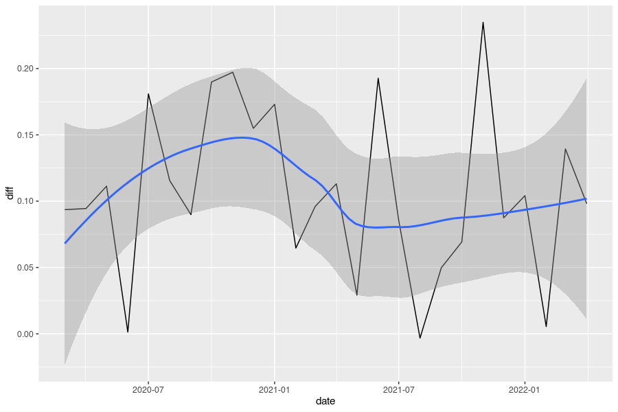

```r
# wonder_url <- tothewonder:::session_ucd99()
```

Trump Voters Should Get Vaxxed


```r
library(tothewonder)
library(ggplot2)
library(scales)
library(dplyr)
library(purrr)

trump_2020 <- read.csv("https://raw.githubusercontent.com/yukatapangolin/US_County_Level_Election_Results_08-20/master/2020_US_County_Level_Presidential_Results.csv",
                       colClasses = c("character", "character",
                                      "character", "integer",
                                      "integer", "integer",
                                      "integer", "numeric",
                                      "numeric", "numeric"))
trump_2020$winner <- ifelse(trump_2020$per_gop > trump_2020$per_dem, "Trump", "Biden")
trump_2020$margins <- cut(trump_2020$per_point_diff,
                          c(-1, -.2, 0, .2, 1),
                          labels = NULL,
                          ordered_result = TRUE)

trump_2020 <- subset(trump_2020, state_name != "Alaska")
# Shannon County (46113) became Oglala Lakota County (46102) in 2015 and
# WONDER doesn't know about the new FIPS code
# https://en.wikipedia.org/wiki/Oglala_Lakota_County,_South_Dakota
trump_2020$county_fips[which(trump_2020$county_fips == 46102)] <- 46113
```


Population data is not available from the Multiple Cause of Death files, so instead
we use the population from the Underlying Cause of Death (2020, last year available)


```r
population <- map_dfr(unique(trump_2020$margins), .f = \(x) {
  counties <- unique(subset(trump_2020, margins == x))$county_fips
  df <- ucd99(wonder_url = wonder_url_ucd99,
                         group_by_1 = "Single-Year Ages",
                         group_by_2 = "Race",
                         group_by_3 = "Year",
                         age = 65:84,
                         period = 2020,

                         residence_fips = counties,

                         hispanic_origin = "Not Hispanic or Latino",
                         race = c("White"),
                         ucd_option = "ICD-10 Codes",
                         ucd_icd_codes = "U07.1")
  df$trump_margin <- x
  return(df)
})

population <- population[!is.na(population$Year.Code),]
population <- population[, c("Single.Year.Ages.Code", "Population",
                             "trump_margin")]
```

Download COVID death for Trump +20% and Biden +20% counties


```r
wonder_url_mcod18 <- session_mcd_provisional(I_Agree = TRUE)
covid_deaths <- map_dfr( unique(trump_2020$margins), .f = \(x) {
  counties <- unique(subset(trump_2020, margins == x))$county_fips
  df <- mcd_provisional(wonder_url = wonder_url_mcod18,
                         group_by_1 = "Single-Year Ages",
                         group_by_2 = "Single Race 6",
                         group_by_3 = "Month",
                         age = 65:84,
                         period_option = "Year",
                         period = format(seq(as.Date("2020-03-01"),
                                             as.Date("2022-04-01"),
                                             by = "month"),
                                         "%Y/%m"),
                         residence_fips = counties,

                         hispanic_origin = "Not Hispanic or Latino",
                         race_option = "Single Race 6",
                         race = c("White"),

                         ucd_icd_codes = "U07.1",)
  df$trump_margin <- x
  return(df)
})
#> Warning in mcd_provisional(wonder_url = wonder_url_mcod18, group_by_1 = "Single-
#> Year Ages", : Population and Rates are not available when values are selected
#> for Single-Year Ages or Ten-Year Age Groups in section 3 or they appear in Group
#> Results By list in section 1, and county level locations or urbanization values
#> are selected in section 2 or County or Urbanization appears in the Group Results
#> By list in section 1. Population, Rates and related measures have been removed
#> from the results. <a href="/wonder/help/mcd-provisional.html#Constraints-Rates"
#> target="WONDER_Help" onclick="setfocus('WONDER_Help')">More information.</a>

#> Warning in mcd_provisional(wonder_url = wonder_url_mcod18, group_by_1 = "Single-
#> Year Ages", : Population and Rates are not available when values are selected
#> for Single-Year Ages or Ten-Year Age Groups in section 3 or they appear in Group
#> Results By list in section 1, and county level locations or urbanization values
#> are selected in section 2 or County or Urbanization appears in the Group Results
#> By list in section 1. Population, Rates and related measures have been removed
#> from the results. <a href="/wonder/help/mcd-provisional.html#Constraints-Rates"
#> target="WONDER_Help" onclick="setfocus('WONDER_Help')">More information.</a>

#> Warning in mcd_provisional(wonder_url = wonder_url_mcod18, group_by_1 = "Single-
#> Year Ages", : Population and Rates are not available when values are selected
#> for Single-Year Ages or Ten-Year Age Groups in section 3 or they appear in Group
#> Results By list in section 1, and county level locations or urbanization values
#> are selected in section 2 or County or Urbanization appears in the Group Results
#> By list in section 1. Population, Rates and related measures have been removed
#> from the results. <a href="/wonder/help/mcd-provisional.html#Constraints-Rates"
#> target="WONDER_Help" onclick="setfocus('WONDER_Help')">More information.</a>

#> Warning in mcd_provisional(wonder_url = wonder_url_mcod18, group_by_1 = "Single-
#> Year Ages", : Population and Rates are not available when values are selected
#> for Single-Year Ages or Ten-Year Age Groups in section 3 or they appear in Group
#> Results By list in section 1, and county level locations or urbanization values
#> are selected in section 2 or County or Urbanization appears in the Group Results
#> By list in section 1. Population, Rates and related measures have been removed
#> from the results. <a href="/wonder/help/mcd-provisional.html#Constraints-Rates"
#> target="WONDER_Help" onclick="setfocus('WONDER_Help')">More information.</a>
```

Percentage difference between Trump +20 and Biden +20 by age group


```r
## length(grep("Year/Month: Jan., 2022", covid_deaths$Notes)) == 4

covid_deaths$Population <- NULL
covid_deaths$Year.Code <- 2022
covid_deaths <- covid_deaths |>
  filter(Notes != "Total") |>
  filter(Single.Race.6 != "")

df2 <- left_join(covid_deaths, population, by = c("Single.Year.Ages.Code",
                                                  "trump_margin"))
df2$rate <- df2$Deaths / df2$Population * 10^6
```


```r
df2 |>
  filter(trump_margin %in% c("(0.2,1]", "(-1,-0.2]")) |>
  mutate(date = as.Date(paste0(Month.Code, "/01"))) |>
  ggplot(aes(date, rate, group = trump_margin, color = trump_margin)) +
  geom_line() +
  facet_wrap(~ Single.Year.Ages.Code)
```




```r
df2 |>
  filter(trump_margin %in% c("(0.2,1]", "(-1,-0.2]")) |>
  mutate(date = as.Date(paste0(Month.Code, "/01"))) |>
  group_by(trump_margin, date) |>
  summarise(rate = mean(rate), .groups = "drop") |>
  ggplot(aes(date, rate, group = trump_margin, color = trump_margin)) +
  geom_line()
```



Rate difference


```r
df2 |>
  filter(trump_margin %in% c("(0.2,1]", "(-1,-0.2]")) |>
  group_by(Single.Year.Ages.Code, Month.Code) |>
  arrange(trump_margin) |>
  summarise(diff = (rate[2] - rate[1]) / rate[1], .groups = "drop") |>
  mutate(date = as.Date(paste0(Month.Code, "/01"))) |>
  ggplot(aes(date, diff)) +
  geom_line() +
  facet_wrap(~ Single.Year.Ages.Code)
```




```r
df2 |>
  filter(trump_margin %in% c("(0.2,1]", "(-1,-0.2]")) |>
  group_by(Month.Code) |>
  arrange(trump_margin) |>
  summarise(diff = mean((rate[2] - rate[1]) / rate[1]), .groups = "drop") |>
  mutate(date = as.Date(paste0(Month.Code, "/01"))) |>
  ggplot(aes(date, diff)) +
  geom_line() +
  geom_smooth()
#> `geom_smooth()` using method = 'loess' and formula 'y ~ x'
```


