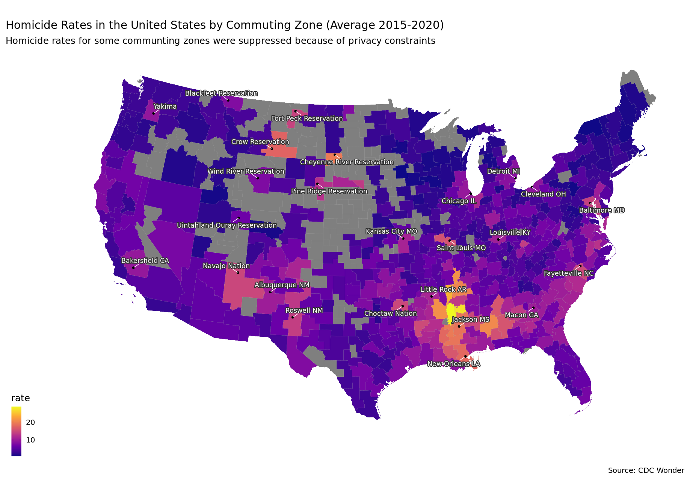
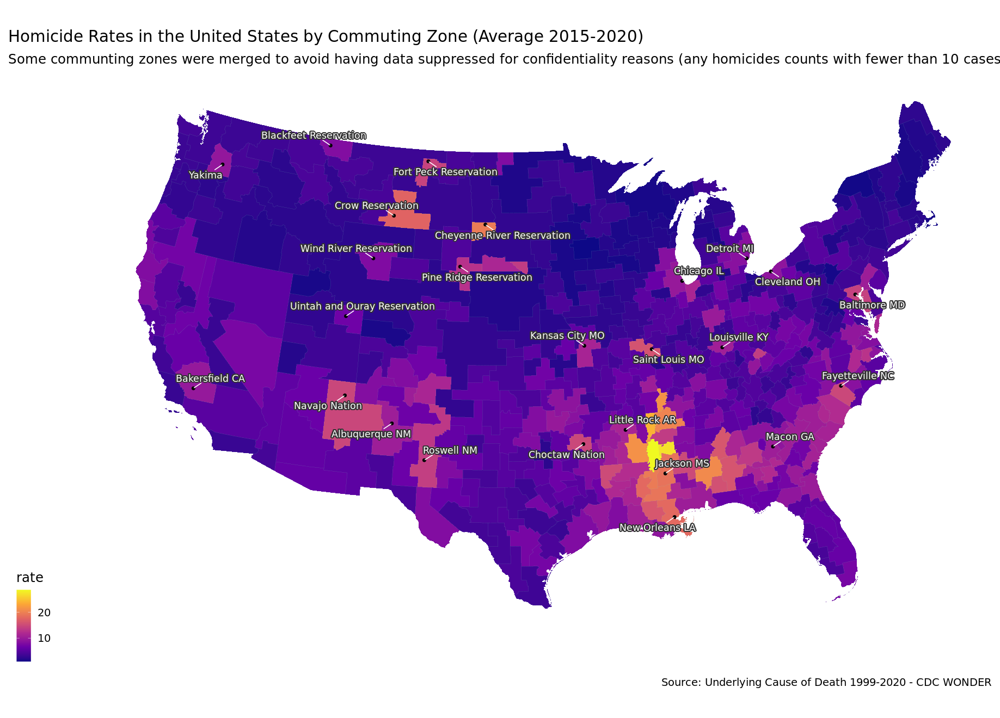

```r
library(tothewonder)
library(ggplot2)
library(maps)
library(maptools)
library(sf)
library(tidyverse)
library(ggthemes)
library(ggrepel)

# Change this filepath to the filepath of your downloaded file
# with the counties that make up the commuting zones
# https://sites.psu.edu/psucz/files/2018/09/counties10-zqvz0r.csv
counties<- read.csv("https://raw.githubusercontent.com/yukatapangolin/files-tothewonder/master/counties10-zqvz0r.csv")
# Need to a leading zero to the FIPS codes
counties$FIPS <- ifelse(nchar(counties$FIPS) == 4,
                        paste0("0", counties$FIPS), counties$FIPS)
```


```r
# wonder_url <- tothewonder:::session_ucd99()
```


```r
lm_homicides <- data.frame()
i <- 1
for (lm_code in unique(counties$OUT10)) {
  message(sprintf("Downloading labor market: %s (%s of %s)",
                  lm_code,
                  i,
                  length(unique(counties$OUT10))))
  i <- i + 1
  counties_in_lm <- unique(subset(counties, OUT10 == lm_code)$FIPS)
  df <- ucd99(wonder_url = wonder_url,
                               group_by_1 = "Injury Intent",
                               group_by_2 = "None",
                               group_by_3 = "None",
                               group_by_4 = "None",
                               show_confidence_interval = TRUE,
                               show_standard_error = FALSE,
                               show_totals = FALSE,
                               age = "All Ages",
                               period = 2015:2020,
                               residence_urbanization_year = "2013",
                               residence_urbanization = "All Categories",
                               residence_fips = counties_in_lm,
                               weekday = c("All Weekdays"),
                               autopsy = c("All Values"),
                               place_of_death = c("All Places"),
                               gender = c("All"),
                               hispanic_origin = "All",
                               race = "All",
                               ucd_option = "Injury Intent and Mechanism",
                               ucd_injury_intent = "Homicide",
                               ucd_injury_mechanism = "All Causes of Death"
  )
  df$LM_Code <- lm_code
  lm_homicides <- rbind(lm_homicides, df)
}
#> Warning in ucd99(wonder_url = wonder_url, group_by_1 = "Injury Intent", : Totals
#> are not available for these results due to suppression constraints. <a href="/
#> wonder/help/faq.html#Privacy">More Information.</a>

#> Warning in ucd99(wonder_url = wonder_url, group_by_1 = "Injury Intent", : Totals
#> are not available for these results due to suppression constraints. <a href="/
#> wonder/help/faq.html#Privacy">More Information.</a>

#> Warning in ucd99(wonder_url = wonder_url, group_by_1 = "Injury Intent", : Totals
#> are not available for these results due to suppression constraints. <a href="/
#> wonder/help/faq.html#Privacy">More Information.</a>

#> Warning in ucd99(wonder_url = wonder_url, group_by_1 = "Injury Intent", : Totals
#> are not available for these results due to suppression constraints. <a href="/
#> wonder/help/faq.html#Privacy">More Information.</a>

#> Warning in ucd99(wonder_url = wonder_url, group_by_1 = "Injury Intent", : Totals
#> are not available for these results due to suppression constraints. <a href="/
#> wonder/help/faq.html#Privacy">More Information.</a>

#> Warning in ucd99(wonder_url = wonder_url, group_by_1 = "Injury Intent", : Totals
#> are not available for these results due to suppression constraints. <a href="/
#> wonder/help/faq.html#Privacy">More Information.</a>

#> Warning in ucd99(wonder_url = wonder_url, group_by_1 = "Injury Intent", : Totals
#> are not available for these results due to suppression constraints. <a href="/
#> wonder/help/faq.html#Privacy">More Information.</a>

#> Warning in ucd99(wonder_url = wonder_url, group_by_1 = "Injury Intent", : Totals
#> are not available for these results due to suppression constraints. <a href="/
#> wonder/help/faq.html#Privacy">More Information.</a>

#> Warning in ucd99(wonder_url = wonder_url, group_by_1 = "Injury Intent", : Totals
#> are not available for these results due to suppression constraints. <a href="/
#> wonder/help/faq.html#Privacy">More Information.</a>

#> Warning in ucd99(wonder_url = wonder_url, group_by_1 = "Injury Intent", : Totals
#> are not available for these results due to suppression constraints. <a href="/
#> wonder/help/faq.html#Privacy">More Information.</a>

#> Warning in ucd99(wonder_url = wonder_url, group_by_1 = "Injury Intent", : Totals
#> are not available for these results due to suppression constraints. <a href="/
#> wonder/help/faq.html#Privacy">More Information.</a>

#> Warning in ucd99(wonder_url = wonder_url, group_by_1 = "Injury Intent", : Totals
#> are not available for these results due to suppression constraints. <a href="/
#> wonder/help/faq.html#Privacy">More Information.</a>

#> Warning in ucd99(wonder_url = wonder_url, group_by_1 = "Injury Intent", : Totals
#> are not available for these results due to suppression constraints. <a href="/
#> wonder/help/faq.html#Privacy">More Information.</a>

#> Warning in ucd99(wonder_url = wonder_url, group_by_1 = "Injury Intent", : Totals
#> are not available for these results due to suppression constraints. <a href="/
#> wonder/help/faq.html#Privacy">More Information.</a>

#> Warning in ucd99(wonder_url = wonder_url, group_by_1 = "Injury Intent", : Totals
#> are not available for these results due to suppression constraints. <a href="/
#> wonder/help/faq.html#Privacy">More Information.</a>

#> Warning in ucd99(wonder_url = wonder_url, group_by_1 = "Injury Intent", : Totals
#> are not available for these results due to suppression constraints. <a href="/
#> wonder/help/faq.html#Privacy">More Information.</a>

#> Warning in ucd99(wonder_url = wonder_url, group_by_1 = "Injury Intent", : Totals
#> are not available for these results due to suppression constraints. <a href="/
#> wonder/help/faq.html#Privacy">More Information.</a>

#> Warning in ucd99(wonder_url = wonder_url, group_by_1 = "Injury Intent", : Totals
#> are not available for these results due to suppression constraints. <a href="/
#> wonder/help/faq.html#Privacy">More Information.</a>

#> Warning in ucd99(wonder_url = wonder_url, group_by_1 = "Injury Intent", : Totals
#> are not available for these results due to suppression constraints. <a href="/
#> wonder/help/faq.html#Privacy">More Information.</a>

#> Warning in ucd99(wonder_url = wonder_url, group_by_1 = "Injury Intent", : Totals
#> are not available for these results due to suppression constraints. <a href="/
#> wonder/help/faq.html#Privacy">More Information.</a>

#> Warning in ucd99(wonder_url = wonder_url, group_by_1 = "Injury Intent", : Totals
#> are not available for these results due to suppression constraints. <a href="/
#> wonder/help/faq.html#Privacy">More Information.</a>

#> Warning in ucd99(wonder_url = wonder_url, group_by_1 = "Injury Intent", : Totals
#> are not available for these results due to suppression constraints. <a href="/
#> wonder/help/faq.html#Privacy">More Information.</a>

#> Warning in ucd99(wonder_url = wonder_url, group_by_1 = "Injury Intent", : Totals
#> are not available for these results due to suppression constraints. <a href="/
#> wonder/help/faq.html#Privacy">More Information.</a>

#> Warning in ucd99(wonder_url = wonder_url, group_by_1 = "Injury Intent", : Totals
#> are not available for these results due to suppression constraints. <a href="/
#> wonder/help/faq.html#Privacy">More Information.</a>

#> Warning in ucd99(wonder_url = wonder_url, group_by_1 = "Injury Intent", : Totals
#> are not available for these results due to suppression constraints. <a href="/
#> wonder/help/faq.html#Privacy">More Information.</a>

#> Warning in ucd99(wonder_url = wonder_url, group_by_1 = "Injury Intent", : Totals
#> are not available for these results due to suppression constraints. <a href="/
#> wonder/help/faq.html#Privacy">More Information.</a>

#> Warning in ucd99(wonder_url = wonder_url, group_by_1 = "Injury Intent", : Totals
#> are not available for these results due to suppression constraints. <a href="/
#> wonder/help/faq.html#Privacy">More Information.</a>

#> Warning in ucd99(wonder_url = wonder_url, group_by_1 = "Injury Intent", : Totals
#> are not available for these results due to suppression constraints. <a href="/
#> wonder/help/faq.html#Privacy">More Information.</a>

#> Warning in ucd99(wonder_url = wonder_url, group_by_1 = "Injury Intent", : Totals
#> are not available for these results due to suppression constraints. <a href="/
#> wonder/help/faq.html#Privacy">More Information.</a>

#> Warning in ucd99(wonder_url = wonder_url, group_by_1 = "Injury Intent", : Totals
#> are not available for these results due to suppression constraints. <a href="/
#> wonder/help/faq.html#Privacy">More Information.</a>

#> Warning in ucd99(wonder_url = wonder_url, group_by_1 = "Injury Intent", : Totals
#> are not available for these results due to suppression constraints. <a href="/
#> wonder/help/faq.html#Privacy">More Information.</a>

#> Warning in ucd99(wonder_url = wonder_url, group_by_1 = "Injury Intent", : Totals
#> are not available for these results due to suppression constraints. <a href="/
#> wonder/help/faq.html#Privacy">More Information.</a>

#> Warning in ucd99(wonder_url = wonder_url, group_by_1 = "Injury Intent", : Totals
#> are not available for these results due to suppression constraints. <a href="/
#> wonder/help/faq.html#Privacy">More Information.</a>

#> Warning in ucd99(wonder_url = wonder_url, group_by_1 = "Injury Intent", : Totals
#> are not available for these results due to suppression constraints. <a href="/
#> wonder/help/faq.html#Privacy">More Information.</a>

#> Warning in ucd99(wonder_url = wonder_url, group_by_1 = "Injury Intent", : Totals
#> are not available for these results due to suppression constraints. <a href="/
#> wonder/help/faq.html#Privacy">More Information.</a>

#> Warning in ucd99(wonder_url = wonder_url, group_by_1 = "Injury Intent", : Totals
#> are not available for these results due to suppression constraints. <a href="/
#> wonder/help/faq.html#Privacy">More Information.</a>

#> Warning in ucd99(wonder_url = wonder_url, group_by_1 = "Injury Intent", : Totals
#> are not available for these results due to suppression constraints. <a href="/
#> wonder/help/faq.html#Privacy">More Information.</a>

#> Warning in ucd99(wonder_url = wonder_url, group_by_1 = "Injury Intent", : Totals
#> are not available for these results due to suppression constraints. <a href="/
#> wonder/help/faq.html#Privacy">More Information.</a>

#> Warning in ucd99(wonder_url = wonder_url, group_by_1 = "Injury Intent", : Totals
#> are not available for these results due to suppression constraints. <a href="/
#> wonder/help/faq.html#Privacy">More Information.</a>

#> Warning in ucd99(wonder_url = wonder_url, group_by_1 = "Injury Intent", : Totals
#> are not available for these results due to suppression constraints. <a href="/
#> wonder/help/faq.html#Privacy">More Information.</a>

#> Warning in ucd99(wonder_url = wonder_url, group_by_1 = "Injury Intent", : Totals
#> are not available for these results due to suppression constraints. <a href="/
#> wonder/help/faq.html#Privacy">More Information.</a>

#> Warning in ucd99(wonder_url = wonder_url, group_by_1 = "Injury Intent", : Totals
#> are not available for these results due to suppression constraints. <a href="/
#> wonder/help/faq.html#Privacy">More Information.</a>

#> Warning in ucd99(wonder_url = wonder_url, group_by_1 = "Injury Intent", : Totals
#> are not available for these results due to suppression constraints. <a href="/
#> wonder/help/faq.html#Privacy">More Information.</a>

#> Warning in ucd99(wonder_url = wonder_url, group_by_1 = "Injury Intent", : Totals
#> are not available for these results due to suppression constraints. <a href="/
#> wonder/help/faq.html#Privacy">More Information.</a>

#> Warning in ucd99(wonder_url = wonder_url, group_by_1 = "Injury Intent", : Totals
#> are not available for these results due to suppression constraints. <a href="/
#> wonder/help/faq.html#Privacy">More Information.</a>

#> Warning in ucd99(wonder_url = wonder_url, group_by_1 = "Injury Intent", : Totals
#> are not available for these results due to suppression constraints. <a href="/
#> wonder/help/faq.html#Privacy">More Information.</a>

#> Warning in ucd99(wonder_url = wonder_url, group_by_1 = "Injury Intent", : Totals
#> are not available for these results due to suppression constraints. <a href="/
#> wonder/help/faq.html#Privacy">More Information.</a>

#> Warning in ucd99(wonder_url = wonder_url, group_by_1 = "Injury Intent", : Totals
#> are not available for these results due to suppression constraints. <a href="/
#> wonder/help/faq.html#Privacy">More Information.</a>

#> Warning in ucd99(wonder_url = wonder_url, group_by_1 = "Injury Intent", : Totals
#> are not available for these results due to suppression constraints. <a href="/
#> wonder/help/faq.html#Privacy">More Information.</a>

#> Warning in ucd99(wonder_url = wonder_url, group_by_1 = "Injury Intent", : Totals
#> are not available for these results due to suppression constraints. <a href="/
#> wonder/help/faq.html#Privacy">More Information.</a>

#> Warning in ucd99(wonder_url = wonder_url, group_by_1 = "Injury Intent", : Totals
#> are not available for these results due to suppression constraints. <a href="/
#> wonder/help/faq.html#Privacy">More Information.</a>

#> Warning in ucd99(wonder_url = wonder_url, group_by_1 = "Injury Intent", : Totals
#> are not available for these results due to suppression constraints. <a href="/
#> wonder/help/faq.html#Privacy">More Information.</a>

#> Warning in ucd99(wonder_url = wonder_url, group_by_1 = "Injury Intent", : Totals
#> are not available for these results due to suppression constraints. <a href="/
#> wonder/help/faq.html#Privacy">More Information.</a>

#> Warning in ucd99(wonder_url = wonder_url, group_by_1 = "Injury Intent", : Totals
#> are not available for these results due to suppression constraints. <a href="/
#> wonder/help/faq.html#Privacy">More Information.</a>

#> Warning in ucd99(wonder_url = wonder_url, group_by_1 = "Injury Intent", : Totals
#> are not available for these results due to suppression constraints. <a href="/
#> wonder/help/faq.html#Privacy">More Information.</a>

#> Warning in ucd99(wonder_url = wonder_url, group_by_1 = "Injury Intent", : Totals
#> are not available for these results due to suppression constraints. <a href="/
#> wonder/help/faq.html#Privacy">More Information.</a>

#> Warning in ucd99(wonder_url = wonder_url, group_by_1 = "Injury Intent", : Totals
#> are not available for these results due to suppression constraints. <a href="/
#> wonder/help/faq.html#Privacy">More Information.</a>

#> Warning in ucd99(wonder_url = wonder_url, group_by_1 = "Injury Intent", : Totals
#> are not available for these results due to suppression constraints. <a href="/
#> wonder/help/faq.html#Privacy">More Information.</a>

#> Warning in ucd99(wonder_url = wonder_url, group_by_1 = "Injury Intent", : Totals
#> are not available for these results due to suppression constraints. <a href="/
#> wonder/help/faq.html#Privacy">More Information.</a>

#> Warning in ucd99(wonder_url = wonder_url, group_by_1 = "Injury Intent", : Totals
#> are not available for these results due to suppression constraints. <a href="/
#> wonder/help/faq.html#Privacy">More Information.</a>

#> Warning in ucd99(wonder_url = wonder_url, group_by_1 = "Injury Intent", : Totals
#> are not available for these results due to suppression constraints. <a href="/
#> wonder/help/faq.html#Privacy">More Information.</a>

#> Warning in ucd99(wonder_url = wonder_url, group_by_1 = "Injury Intent", : Totals
#> are not available for these results due to suppression constraints. <a href="/
#> wonder/help/faq.html#Privacy">More Information.</a>

#> Warning in ucd99(wonder_url = wonder_url, group_by_1 = "Injury Intent", : Totals
#> are not available for these results due to suppression constraints. <a href="/
#> wonder/help/faq.html#Privacy">More Information.</a>

#> Warning in ucd99(wonder_url = wonder_url, group_by_1 = "Injury Intent", : Totals
#> are not available for these results due to suppression constraints. <a href="/
#> wonder/help/faq.html#Privacy">More Information.</a>

#> Warning in ucd99(wonder_url = wonder_url, group_by_1 = "Injury Intent", : Totals
#> are not available for these results due to suppression constraints. <a href="/
#> wonder/help/faq.html#Privacy">More Information.</a>

#> Warning in ucd99(wonder_url = wonder_url, group_by_1 = "Injury Intent", : Totals
#> are not available for these results due to suppression constraints. <a href="/
#> wonder/help/faq.html#Privacy">More Information.</a>

#> Warning in ucd99(wonder_url = wonder_url, group_by_1 = "Injury Intent", : Totals
#> are not available for these results due to suppression constraints. <a href="/
#> wonder/help/faq.html#Privacy">More Information.</a>

#> Warning in ucd99(wonder_url = wonder_url, group_by_1 = "Injury Intent", : Totals
#> are not available for these results due to suppression constraints. <a href="/
#> wonder/help/faq.html#Privacy">More Information.</a>

#> Warning in ucd99(wonder_url = wonder_url, group_by_1 = "Injury Intent", : Totals
#> are not available for these results due to suppression constraints. <a href="/
#> wonder/help/faq.html#Privacy">More Information.</a>

#> Warning in ucd99(wonder_url = wonder_url, group_by_1 = "Injury Intent", : Totals
#> are not available for these results due to suppression constraints. <a href="/
#> wonder/help/faq.html#Privacy">More Information.</a>

#> Warning in ucd99(wonder_url = wonder_url, group_by_1 = "Injury Intent", : Totals
#> are not available for these results due to suppression constraints. <a href="/
#> wonder/help/faq.html#Privacy">More Information.</a>

#> Warning in ucd99(wonder_url = wonder_url, group_by_1 = "Injury Intent", : Totals
#> are not available for these results due to suppression constraints. <a href="/
#> wonder/help/faq.html#Privacy">More Information.</a>

#> Warning in ucd99(wonder_url = wonder_url, group_by_1 = "Injury Intent", : Totals
#> are not available for these results due to suppression constraints. <a href="/
#> wonder/help/faq.html#Privacy">More Information.</a>

#> Warning in ucd99(wonder_url = wonder_url, group_by_1 = "Injury Intent", : Totals
#> are not available for these results due to suppression constraints. <a href="/
#> wonder/help/faq.html#Privacy">More Information.</a>

#> Warning in ucd99(wonder_url = wonder_url, group_by_1 = "Injury Intent", : Totals
#> are not available for these results due to suppression constraints. <a href="/
#> wonder/help/faq.html#Privacy">More Information.</a>

#> Warning in ucd99(wonder_url = wonder_url, group_by_1 = "Injury Intent", : Totals
#> are not available for these results due to suppression constraints. <a href="/
#> wonder/help/faq.html#Privacy">More Information.</a>

#> Warning in ucd99(wonder_url = wonder_url, group_by_1 = "Injury Intent", : Totals
#> are not available for these results due to suppression constraints. <a href="/
#> wonder/help/faq.html#Privacy">More Information.</a>

#> Warning in ucd99(wonder_url = wonder_url, group_by_1 = "Injury Intent", : Totals
#> are not available for these results due to suppression constraints. <a href="/
#> wonder/help/faq.html#Privacy">More Information.</a>

#> Warning in ucd99(wonder_url = wonder_url, group_by_1 = "Injury Intent", : Totals
#> are not available for these results due to suppression constraints. <a href="/
#> wonder/help/faq.html#Privacy">More Information.</a>

#> Warning in ucd99(wonder_url = wonder_url, group_by_1 = "Injury Intent", : Totals
#> are not available for these results due to suppression constraints. <a href="/
#> wonder/help/faq.html#Privacy">More Information.</a>

#> Warning in ucd99(wonder_url = wonder_url, group_by_1 = "Injury Intent", : Totals
#> are not available for these results due to suppression constraints. <a href="/
#> wonder/help/faq.html#Privacy">More Information.</a>

#> Warning in ucd99(wonder_url = wonder_url, group_by_1 = "Injury Intent", : Totals
#> are not available for these results due to suppression constraints. <a href="/
#> wonder/help/faq.html#Privacy">More Information.</a>

#> Warning in ucd99(wonder_url = wonder_url, group_by_1 = "Injury Intent", : Totals
#> are not available for these results due to suppression constraints. <a href="/
#> wonder/help/faq.html#Privacy">More Information.</a>

#> Warning in ucd99(wonder_url = wonder_url, group_by_1 = "Injury Intent", : Totals
#> are not available for these results due to suppression constraints. <a href="/
#> wonder/help/faq.html#Privacy">More Information.</a>

#> Warning in ucd99(wonder_url = wonder_url, group_by_1 = "Injury Intent", : Totals
#> are not available for these results due to suppression constraints. <a href="/
#> wonder/help/faq.html#Privacy">More Information.</a>

#> Warning in ucd99(wonder_url = wonder_url, group_by_1 = "Injury Intent", : Totals
#> are not available for these results due to suppression constraints. <a href="/
#> wonder/help/faq.html#Privacy">More Information.</a>

#> Warning in ucd99(wonder_url = wonder_url, group_by_1 = "Injury Intent", : Totals
#> are not available for these results due to suppression constraints. <a href="/
#> wonder/help/faq.html#Privacy">More Information.</a>

#> Warning in ucd99(wonder_url = wonder_url, group_by_1 = "Injury Intent", : Totals
#> are not available for these results due to suppression constraints. <a href="/
#> wonder/help/faq.html#Privacy">More Information.</a>

#> Warning in ucd99(wonder_url = wonder_url, group_by_1 = "Injury Intent", : Totals
#> are not available for these results due to suppression constraints. <a href="/
#> wonder/help/faq.html#Privacy">More Information.</a>

#> Warning in ucd99(wonder_url = wonder_url, group_by_1 = "Injury Intent", : Totals
#> are not available for these results due to suppression constraints. <a href="/
#> wonder/help/faq.html#Privacy">More Information.</a>

#> Warning in ucd99(wonder_url = wonder_url, group_by_1 = "Injury Intent", : Totals
#> are not available for these results due to suppression constraints. <a href="/
#> wonder/help/faq.html#Privacy">More Information.</a>

#> Warning in ucd99(wonder_url = wonder_url, group_by_1 = "Injury Intent", : Totals
#> are not available for these results due to suppression constraints. <a href="/
#> wonder/help/faq.html#Privacy">More Information.</a>

#> Warning in ucd99(wonder_url = wonder_url, group_by_1 = "Injury Intent", : Totals
#> are not available for these results due to suppression constraints. <a href="/
#> wonder/help/faq.html#Privacy">More Information.</a>

#> Warning in ucd99(wonder_url = wonder_url, group_by_1 = "Injury Intent", : Totals
#> are not available for these results due to suppression constraints. <a href="/
#> wonder/help/faq.html#Privacy">More Information.</a>

#> Warning in ucd99(wonder_url = wonder_url, group_by_1 = "Injury Intent", : Totals
#> are not available for these results due to suppression constraints. <a href="/
#> wonder/help/faq.html#Privacy">More Information.</a>

#> Warning in ucd99(wonder_url = wonder_url, group_by_1 = "Injury Intent", : Totals
#> are not available for these results due to suppression constraints. <a href="/
#> wonder/help/faq.html#Privacy">More Information.</a>

#> Warning in ucd99(wonder_url = wonder_url, group_by_1 = "Injury Intent", : Totals
#> are not available for these results due to suppression constraints. <a href="/
#> wonder/help/faq.html#Privacy">More Information.</a>

#> Warning in ucd99(wonder_url = wonder_url, group_by_1 = "Injury Intent", : Totals
#> are not available for these results due to suppression constraints. <a href="/
#> wonder/help/faq.html#Privacy">More Information.</a>

#> Warning in ucd99(wonder_url = wonder_url, group_by_1 = "Injury Intent", : Totals
#> are not available for these results due to suppression constraints. <a href="/
#> wonder/help/faq.html#Privacy">More Information.</a>

#> Warning in ucd99(wonder_url = wonder_url, group_by_1 = "Injury Intent", : Totals
#> are not available for these results due to suppression constraints. <a href="/
#> wonder/help/faq.html#Privacy">More Information.</a>

#> Warning in ucd99(wonder_url = wonder_url, group_by_1 = "Injury Intent", : Totals
#> are not available for these results due to suppression constraints. <a href="/
#> wonder/help/faq.html#Privacy">More Information.</a>

#> Warning in ucd99(wonder_url = wonder_url, group_by_1 = "Injury Intent", : Totals
#> are not available for these results due to suppression constraints. <a href="/
#> wonder/help/faq.html#Privacy">More Information.</a>

#> Warning in ucd99(wonder_url = wonder_url, group_by_1 = "Injury Intent", : Totals
#> are not available for these results due to suppression constraints. <a href="/
#> wonder/help/faq.html#Privacy">More Information.</a>

#> Warning in ucd99(wonder_url = wonder_url, group_by_1 = "Injury Intent", : Totals
#> are not available for these results due to suppression constraints. <a href="/
#> wonder/help/faq.html#Privacy">More Information.</a>

#> Warning in ucd99(wonder_url = wonder_url, group_by_1 = "Injury Intent", : Totals
#> are not available for these results due to suppression constraints. <a href="/
#> wonder/help/faq.html#Privacy">More Information.</a>

#> Warning in ucd99(wonder_url = wonder_url, group_by_1 = "Injury Intent", : Totals
#> are not available for these results due to suppression constraints. <a href="/
#> wonder/help/faq.html#Privacy">More Information.</a>

#> Warning in ucd99(wonder_url = wonder_url, group_by_1 = "Injury Intent", : Totals
#> are not available for these results due to suppression constraints. <a href="/
#> wonder/help/faq.html#Privacy">More Information.</a>

#> Warning in ucd99(wonder_url = wonder_url, group_by_1 = "Injury Intent", : Totals
#> are not available for these results due to suppression constraints. <a href="/
#> wonder/help/faq.html#Privacy">More Information.</a>

#> Warning in ucd99(wonder_url = wonder_url, group_by_1 = "Injury Intent", : Totals
#> are not available for these results due to suppression constraints. <a href="/
#> wonder/help/faq.html#Privacy">More Information.</a>

#> Warning in ucd99(wonder_url = wonder_url, group_by_1 = "Injury Intent", : Totals
#> are not available for these results due to suppression constraints. <a href="/
#> wonder/help/faq.html#Privacy">More Information.</a>

#> Warning in ucd99(wonder_url = wonder_url, group_by_1 = "Injury Intent", : Totals
#> are not available for these results due to suppression constraints. <a href="/
#> wonder/help/faq.html#Privacy">More Information.</a>

#> Warning in ucd99(wonder_url = wonder_url, group_by_1 = "Injury Intent", : Totals
#> are not available for these results due to suppression constraints. <a href="/
#> wonder/help/faq.html#Privacy">More Information.</a>

#> Warning in ucd99(wonder_url = wonder_url, group_by_1 = "Injury Intent", : Totals
#> are not available for these results due to suppression constraints. <a href="/
#> wonder/help/faq.html#Privacy">More Information.</a>

#> Warning in ucd99(wonder_url = wonder_url, group_by_1 = "Injury Intent", : Totals
#> are not available for these results due to suppression constraints. <a href="/
#> wonder/help/faq.html#Privacy">More Information.</a>

#> Warning in ucd99(wonder_url = wonder_url, group_by_1 = "Injury Intent", : Totals
#> are not available for these results due to suppression constraints. <a href="/
#> wonder/help/faq.html#Privacy">More Information.</a>

#> Warning in ucd99(wonder_url = wonder_url, group_by_1 = "Injury Intent", : Totals
#> are not available for these results due to suppression constraints. <a href="/
#> wonder/help/faq.html#Privacy">More Information.</a>

#> Warning in ucd99(wonder_url = wonder_url, group_by_1 = "Injury Intent", : Totals
#> are not available for these results due to suppression constraints. <a href="/
#> wonder/help/faq.html#Privacy">More Information.</a>

#> Warning in ucd99(wonder_url = wonder_url, group_by_1 = "Injury Intent", : Totals
#> are not available for these results due to suppression constraints. <a href="/
#> wonder/help/faq.html#Privacy">More Information.</a>

#> Warning in ucd99(wonder_url = wonder_url, group_by_1 = "Injury Intent", : Totals
#> are not available for these results due to suppression constraints. <a href="/
#> wonder/help/faq.html#Privacy">More Information.</a>

#> Warning in ucd99(wonder_url = wonder_url, group_by_1 = "Injury Intent", : Totals
#> are not available for these results due to suppression constraints. <a href="/
#> wonder/help/faq.html#Privacy">More Information.</a>

#> Warning in ucd99(wonder_url = wonder_url, group_by_1 = "Injury Intent", : Totals
#> are not available for these results due to suppression constraints. <a href="/
#> wonder/help/faq.html#Privacy">More Information.</a>

#> Warning in ucd99(wonder_url = wonder_url, group_by_1 = "Injury Intent", : Totals
#> are not available for these results due to suppression constraints. <a href="/
#> wonder/help/faq.html#Privacy">More Information.</a>

#> Warning in ucd99(wonder_url = wonder_url, group_by_1 = "Injury Intent", : Totals
#> are not available for these results due to suppression constraints. <a href="/
#> wonder/help/faq.html#Privacy">More Information.</a>

#> Warning in ucd99(wonder_url = wonder_url, group_by_1 = "Injury Intent", : Totals
#> are not available for these results due to suppression constraints. <a href="/
#> wonder/help/faq.html#Privacy">More Information.</a>

#> Warning in ucd99(wonder_url = wonder_url, group_by_1 = "Injury Intent", : Totals
#> are not available for these results due to suppression constraints. <a href="/
#> wonder/help/faq.html#Privacy">More Information.</a>

#> Warning in ucd99(wonder_url = wonder_url, group_by_1 = "Injury Intent", : Totals
#> are not available for these results due to suppression constraints. <a href="/
#> wonder/help/faq.html#Privacy">More Information.</a>

#> Warning in ucd99(wonder_url = wonder_url, group_by_1 = "Injury Intent", : Totals
#> are not available for these results due to suppression constraints. <a href="/
#> wonder/help/faq.html#Privacy">More Information.</a>

#> Warning in ucd99(wonder_url = wonder_url, group_by_1 = "Injury Intent", : Totals
#> are not available for these results due to suppression constraints. <a href="/
#> wonder/help/faq.html#Privacy">More Information.</a>

#> Warning in ucd99(wonder_url = wonder_url, group_by_1 = "Injury Intent", : Totals
#> are not available for these results due to suppression constraints. <a href="/
#> wonder/help/faq.html#Privacy">More Information.</a>

#> Warning in ucd99(wonder_url = wonder_url, group_by_1 = "Injury Intent", : Totals
#> are not available for these results due to suppression constraints. <a href="/
#> wonder/help/faq.html#Privacy">More Information.</a>

#> Warning in ucd99(wonder_url = wonder_url, group_by_1 = "Injury Intent", : Totals
#> are not available for these results due to suppression constraints. <a href="/
#> wonder/help/faq.html#Privacy">More Information.</a>

#> Warning in ucd99(wonder_url = wonder_url, group_by_1 = "Injury Intent", : Totals
#> are not available for these results due to suppression constraints. <a href="/
#> wonder/help/faq.html#Privacy">More Information.</a>

#> Warning in ucd99(wonder_url = wonder_url, group_by_1 = "Injury Intent", : Totals
#> are not available for these results due to suppression constraints. <a href="/
#> wonder/help/faq.html#Privacy">More Information.</a>

#> Warning in ucd99(wonder_url = wonder_url, group_by_1 = "Injury Intent", : Totals
#> are not available for these results due to suppression constraints. <a href="/
#> wonder/help/faq.html#Privacy">More Information.</a>

#> Warning in ucd99(wonder_url = wonder_url, group_by_1 = "Injury Intent", : Totals
#> are not available for these results due to suppression constraints. <a href="/
#> wonder/help/faq.html#Privacy">More Information.</a>

#> Warning in ucd99(wonder_url = wonder_url, group_by_1 = "Injury Intent", : Totals
#> are not available for these results due to suppression constraints. <a href="/
#> wonder/help/faq.html#Privacy">More Information.</a>

#> Warning in ucd99(wonder_url = wonder_url, group_by_1 = "Injury Intent", : Totals
#> are not available for these results due to suppression constraints. <a href="/
#> wonder/help/faq.html#Privacy">More Information.</a>

#> Warning in ucd99(wonder_url = wonder_url, group_by_1 = "Injury Intent", : Totals
#> are not available for these results due to suppression constraints. <a href="/
#> wonder/help/faq.html#Privacy">More Information.</a>

#> Warning in ucd99(wonder_url = wonder_url, group_by_1 = "Injury Intent", : Totals
#> are not available for these results due to suppression constraints. <a href="/
#> wonder/help/faq.html#Privacy">More Information.</a>

#> Warning in ucd99(wonder_url = wonder_url, group_by_1 = "Injury Intent", : Totals
#> are not available for these results due to suppression constraints. <a href="/
#> wonder/help/faq.html#Privacy">More Information.</a>

#> Warning in ucd99(wonder_url = wonder_url, group_by_1 = "Injury Intent", : Totals
#> are not available for these results due to suppression constraints. <a href="/
#> wonder/help/faq.html#Privacy">More Information.</a>

#> Warning in ucd99(wonder_url = wonder_url, group_by_1 = "Injury Intent", : Totals
#> are not available for these results due to suppression constraints. <a href="/
#> wonder/help/faq.html#Privacy">More Information.</a>

#> Warning in ucd99(wonder_url = wonder_url, group_by_1 = "Injury Intent", : Totals
#> are not available for these results due to suppression constraints. <a href="/
#> wonder/help/faq.html#Privacy">More Information.</a>

#> Warning in ucd99(wonder_url = wonder_url, group_by_1 = "Injury Intent", : Totals
#> are not available for these results due to suppression constraints. <a href="/
#> wonder/help/faq.html#Privacy">More Information.</a>

#> Warning in ucd99(wonder_url = wonder_url, group_by_1 = "Injury Intent", : Totals
#> are not available for these results due to suppression constraints. <a href="/
#> wonder/help/faq.html#Privacy">More Information.</a>

#> Warning in ucd99(wonder_url = wonder_url, group_by_1 = "Injury Intent", : Totals
#> are not available for these results due to suppression constraints. <a href="/
#> wonder/help/faq.html#Privacy">More Information.</a>

#> Warning in ucd99(wonder_url = wonder_url, group_by_1 = "Injury Intent", : Totals
#> are not available for these results due to suppression constraints. <a href="/
#> wonder/help/faq.html#Privacy">More Information.</a>

#> Warning in ucd99(wonder_url = wonder_url, group_by_1 = "Injury Intent", : Totals
#> are not available for these results due to suppression constraints. <a href="/
#> wonder/help/faq.html#Privacy">More Information.</a>

#> Warning in ucd99(wonder_url = wonder_url, group_by_1 = "Injury Intent", : Totals
#> are not available for these results due to suppression constraints. <a href="/
#> wonder/help/faq.html#Privacy">More Information.</a>

#> Warning in ucd99(wonder_url = wonder_url, group_by_1 = "Injury Intent", : Totals
#> are not available for these results due to suppression constraints. <a href="/
#> wonder/help/faq.html#Privacy">More Information.</a>

#> Warning in ucd99(wonder_url = wonder_url, group_by_1 = "Injury Intent", : Totals
#> are not available for these results due to suppression constraints. <a href="/
#> wonder/help/faq.html#Privacy">More Information.</a>

#> Warning in ucd99(wonder_url = wonder_url, group_by_1 = "Injury Intent", : Totals
#> are not available for these results due to suppression constraints. <a href="/
#> wonder/help/faq.html#Privacy">More Information.</a>
lm_homicides$rate <- as.numeric(lm_homicides$Deaths) /
  as.numeric(lm_homicides$Population) * 10^5
#> Warning: NAs introduced by coercion
lm_homicides <- subset(lm_homicides, !is.na(Injury.Intent.Code))
lm_homicides <- subset(lm_homicides,  Notes != "Total")
```


```r

# Download ERS shapefile from
# https://sites.psu.edu/psucz/data/
# https://sites.psu.edu/psucz/files/2018/09/ERS-2010-2fcqzlr.zip
tmpdir <- tempdir()

url <- "https://github.com/yukatapangolin/files-tothewonder/blob/master/ERS-2010-2fcqzlr.tar.xz?raw=true"
download.file(url, paste0(tmpdir, "ERS-2010-2fcqzlr.tar.xz"))
untar(paste0(tmpdir, "ERS-2010-2fcqzlr.tar.xz"), exdir = tmpdir )

ers <- st_read(paste0(tmpdir, "/ERS-2010-2fcqzlr/", "ERS10.shp"))
#> Reading layer `ERS10' from data source 
#>   `/tmp/RtmpgjUPFb/ERS-2010-2fcqzlr/ERS10.shp' using driver `ESRI Shapefile'
#> Simple feature collection with 625 features and 15 fields
#> Geometry type: MULTIPOLYGON
#> Dimension:     XY
#> Bounding box:  xmin: -5794393 ymin: -2114925 xmax: 2516374 ymax: 3909687
#> Projected CRS: Lambert_Azimuthal_Equal_Area
ers <- sf::st_transform(ers, "+init=epsg:2163")
#> Warning in CPL_crs_from_input(x): GDAL Message 1: +init=epsg:XXXX syntax is
#> deprecated. It might return a CRS with a non-EPSG compliant axis order.
# Merge shapefile with homicide data by Labor Market Code
ers_lm <- merge(ers,
                lm_homicides,
                by.x = "LM_Code",
                by.y = "LM_Code",
                all = TRUE)
```


```r
cities <- subset(us.cities,
                 name %in% c("Jackson MS",
                             "Saint Louis MO",
                             "Kansas City MO",
                             "New Orleans LA",
                             "Baltimore MD",
                             "Albuquerque NM",
                             "Chicago IL",
                             "Detroit MI",
                             # "Montgomery AL",
                             "Fayetteville NC",
                             "Roswell NM",
                             "Macon GA",
                             # "Augusta-Richmond GA",
                             "Little Rock AR",
                             "Louisville KY",
                             "Cleveland OH",
                             # "Monroe LA"
                             "Bakersfield CA"
                 ))
cities <- bind_rows(cities,
                    data.frame(long = c(-107.61335124538918, -101.04164640175459,
                                        -94.96111714732727, -109.65981144142951,
                                        -102.74208266163129,
                                        -112.9256, -120.52440,
                                        -108.7542,
                                        -105.41568,
                                        -110.1544),
                               lat = c(45.56390829384348, 45.36231401369709,
                                       34.16175169130852,36.30291737755267,
                                       43.212949784070844,
                                       48.6579, 46.60119,
                                       43.3245,
                                       48.42878,
                                       40.2772),
                               name = c("Crow Reservation", "Cheyenne River Reservation",
                                        "Choctaw Nation", "Navajo Nation",
                                        "Pine Ridge Reservation",
                                        "Blackfeet Reservation",
                                        "Yakima",
                                        "Wind River Reservation",
                                        "Fort Peck Reservation",
                                        "Uintah and Ouray Reservation"))
)
cities <- st_as_sf(x = cities, coords = c("long", "lat"),
                   crs = "+proj=longlat +datum=WGS84 +ellps=WGS84 +towgs84=0,0,0")
ggplot() +
  geom_sf(data = ers_lm, aes(fill = rate), color = "transparent") +
  geom_sf(data = ers, aes(), color = "darkgray", fill = "transparent", size = .05) +
  labs(title = "Homicide Rates in the United States by Commuting Zone (Average 2015-2020)",
       subtitle = "Homicide rates for some communting zones were suppressed because of privacy constraints",
       caption = "Source: CDC Wonder") +
  geom_sf(data = cities) +
  geom_text_repel(data = cities, aes(x=st_coordinates(geometry)[,1],
                                     y=st_coordinates(geometry)[,2],
                                     label = name),
                  color = "white",
                  bg.color = "gray20",
                  bg.r = 0.15,
                  box.padding = .5,
                  family = "Roboto", size = 4) +
  theme_map(base_size = 20) +
  scale_fill_viridis_c(na.value = "grey50", option = "plasma") +
  coord_sf(crs = st_crs(2163), datum = NA,
           xlim = c(-2500000, 2500000), ylim = c(-2300000,
                                                 730000)) +
  theme(plot.background = element_rect(fill = "white", color = "white"),
        text=element_text(size=16,  family = "SF Pro Display"))
```




```r

new_cz <- list(
  #Alaska
  c(24, 28, 35, 29, 25),
  c(17, 16, 22, 18, 20),
  c(26, 27, 21),

  c(604, 602),
  c(216, 219, 209, 210),
  c(56, 49),
  c(232, 380),
  c(385, 65),
  c(270, 272),
  c(596, 583, 598, 585),
  c(492,404),
  c(243, 188),
  c(185, 173),
  c(250, 235),
  c(106, 99),
  c(246, 255),
  c(157, 171),
  c(169, 344),
  c(152, 163),
  c(265, 262),
  c(283, 293),
  c(298, 297),
  c(294, 289, 295, 617, 611),
  c(207, 213),
  c(345, 338, 192, 342, 332, 331),
  c(201, 195),
  c(305, 318),
  c(566, 569),
  c(567, 543),


  c(554, 570, 557, 565),

  c(559, 548, 469),
  c(393, 35),
  c(592, 577, 579, 576, 578, 572),
  c(143, 141),
  c(484, 481, 480, 479, 473),
  c(487, 137, 145, 346, 138),
  c(361, 359),
  c(79, 81),
  c(348, 364, 358, 363, 354),
  c(353, 355, 435, 357, 351, 432),
  c(280, 277),
  c(438, 439, 313, 314, 434, 312, 433),
  c(440,511,512,508,507,504,304,502,503),
  c(315,193,316,204,308,307,199,197),
  c(625, 147, 624, 620, 573, 139, 619, 84, 85, 369, 381),
  c(378, 375, 376, 373, 374, 371, 372, 370, 368, 382, 383, 367),
  c(379, 226, 77, 78, 220, 234, 218, 555, 89, 402, 233, 86, 230, 215, 366, 227)
)

counties$LM_Code2 <- counties$OUT10
ers$LM_Code2 <- ers$LM_Code
name = 2e6
for(ll in new_cz) {
  for (v in ll) {
    counties$LM_Code2[which(counties$OUT10 == v)] <- name
    ers$LM_Code2[which(ers$LM_Code == v)] <- name
  }
  name = name + 1
}

ers2 <- ers |>
  group_by(LM_Code2) |>
  summarise(geometry = st_union(geometry)) |>
  ungroup()


lm_homicides2 <- data.frame()
i <- 1
for (lm_code in unique(counties$LM_Code2)) {
  message(sprintf("Downloading labor market: %s (%s of %s)",
                  lm_code,
                  i,
                  length(unique(counties$LM_Code2))))
  i <- i + 1
  counties_in_lm <- unique(subset(counties, LM_Code2 == lm_code)$FIPS)
  df <- ucd99(wonder_url = wonder_url,
               group_by_1 = "Injury Intent",
               group_by_2 = "None",
               group_by_3 = "None",
               group_by_4 = "None",
               show_confidence_interval = TRUE,
               show_standard_error = FALSE,
               show_totals = FALSE,
               age = "All Ages",
               period = 2015:2020,
               residence_urbanization_year = "2013",
               residence_urbanization = "All Categories",
               residence_fips = counties_in_lm,
               weekday = c("All Weekdays"),
               autopsy = c("All Values"),
               place_of_death = c("All Places"),
               gender = c("All"),
               hispanic_origin = "All",
               race = "All",
               ucd_option = "Injury Intent and Mechanism",
               ucd_injury_intent = "Homicide",
               ucd_injury_mechanism = "All Causes of Death"
  )
  df$LM_Code2 <- lm_code
  lm_homicides2 <- rbind(lm_homicides2, df)
}
lm_homicides2$rate <- as.numeric(lm_homicides2$Deaths) /
  as.numeric(lm_homicides2$Population) * 10^5

lm_homicides2 <- subset(lm_homicides2, !is.na(Injury.Intent.Code))
lm_homicides2 <- subset(lm_homicides2,  Notes != "Total")
ers_lm2 <- merge(ers2,
                 lm_homicides2,
                 by.x = "LM_Code2",
                 by.y = "LM_Code2",
                 all = TRUE)
```


```r
ggplot() +
  geom_sf(data = ers_lm2, aes(fill = rate), color = "transparent") +
  geom_sf(data = ers2, aes(), color = "#7fcdbb", fill = "transparent", size = .02) +
  labs(title = "Homicide Rates in the United States by Commuting Zone (Average 2015-2020)",
       subtitle = "Some communting zones were merged to avoid having data suppressed for confidentiality reasons (any homicides counts with fewer than 10 cases are suppressed)",
       caption = "Source: Underlying Cause of Death 1999-2020 - CDC WONDER") +
  geom_sf(data = cities) +
  geom_text_repel(data = cities, aes(x=st_coordinates(geometry)[,1],
                                     y=st_coordinates(geometry)[,2],
                                     label = name),
                  color = "white",
                  bg.color = "gray20",
                  bg.r = 0.15,
                  box.padding = .5,
                  max.overlaps = Inf,
                  family = "Roboto", size = 4) +
  theme_map(base_size = 20) +
  scale_fill_viridis_c(na.value = "grey50", option = "plasma") +
  coord_sf(crs = st_crs(2163), datum = NA,
           xlim = c(-2500000, 2500000), ylim = c(-2300000,
                                                 730000)) +
  theme(plot.background = element_rect(fill = "white", color = "white"),
        text=element_text(size=16,  family="SF Pro Display"))
```


