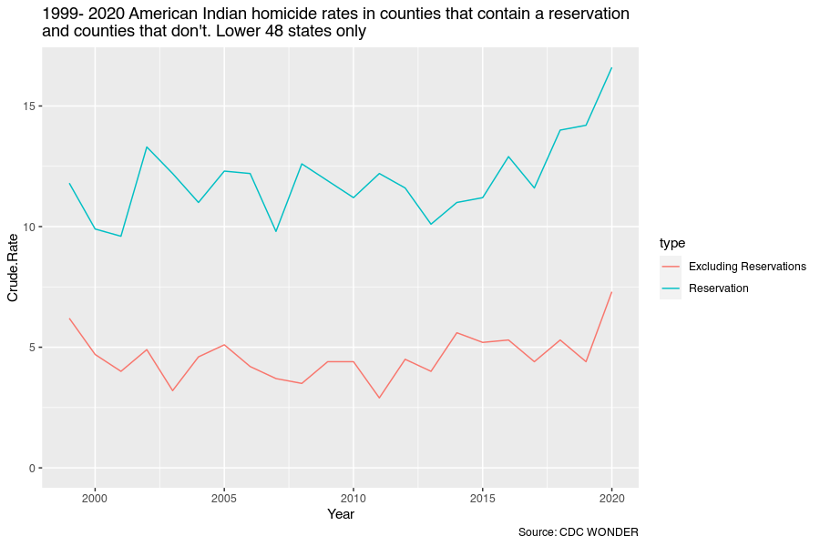

```r
library(tothewonder)
library(sf)
library(maps)
library(ggplot2)
```


```r
# Shapefile from
# https://www2.census.gov/geo/tiger/TIGER2019/AIANNH/tl_2019_us_aiannh.zip
tmpdir <- tempdir()
url <- "https://github.com/yukatapangolin/files-tothewonder/blob/master/aiannh.tar.xz?raw=true"
download.file(url, paste0(tmpdir, "aiannh.tar.xz"))
untar(paste0(tmpdir, "aiannh.tar.xz"), exdir = tmpdir )
aiannh <- st_read(paste0(tmpdir, "/tl/", "tl_2019_us_aiannh.shp"))
#> Reading layer `tl_2019_us_aiannh' from data source 
#>   `/tmp/RtmpEyIr3B/tl/tl_2019_us_aiannh.shp' using driver `ESRI Shapefile'
#> Simple feature collection with 848 features and 15 fields (with 6 geometries empty)
#> Geometry type: MULTIPOLYGON
#> Dimension:     XY
#> Bounding box:  xmin: -174.236 ymin: 18.91077 xmax: -67.03552 ymax: 71.34019
#> Geodetic CRS:  NAD83

#aiannh_big <- subset(aiannh, ALAND > 1e9)
#aiannh_small <- subset(aiannh, ALAND <= 1e9)
```


```r

counties_map <- st_as_sf(maps::map("county", fill=TRUE, col="transparent", plot=FALSE))
st_crs(counties_map) <- 4326
st_crs(aiannh) <- 4326
#> Warning: st_crs<- : replacing crs does not reproject data; use st_transform for
#> that
sf::sf_use_s2(FALSE)
intersect <- st_intersects(counties_map, aiannh)
#> although coordinates are longitude/latitude, st_intersects assumes that they are planar
indian_counties <- counties_map[lengths(intersect) > 0, ]
indian_counties <- merge(indian_counties, maps::county.fips,
                         by.x = "ID", by.y = "polyname")
indian_counties$fips <- ifelse(nchar(indian_counties$fips) == 4,
                               paste0("0", indian_counties$fips), indian_counties$fips)
```


```r
# wonder_url <- tothewonder:::session_ucd99()
```


```r

df_reservation <- ucd99(wonder_url = wonder_url,
                        group_by_1 = "Year",
                        group_by_2 = "None",
                        group_by_3 = "None",
                        group_by_4 = "None",
                        show_confidence_interval = FALSE,
                        show_standard_error = FALSE,
                        age = "All Ages",
                        period = 1999:2020,
                        residence_urbanization_year = "2013",
                        residence_urbanization = "All Categories",
                        residence_fips = indian_counties$fips,
                        weekday = c("All Weekdays"),
                        autopsy = c("All Values"),
                        place_of_death = c("All Places"),
                        gender = c("All"),
                        hispanic_origin = "Not Hispanic or Latino",
                        race = "American Indian or Alaska Native",
                        ucd_option = "Injury Intent and Mechanism",
                        ucd_injury_intent = "Homicide",
                        ucd_injury_mechanism = "All Causes of Death"
)
df_reservation$type <- "Reservation"
df_all <- ucd99(wonder_url = wonder_url,
                group_by_1 = "County",
                group_by_2 = "None",
                group_by_3 = "None",
                group_by_4 = "None",
                show_confidence_interval = FALSE,
                show_standard_error = FALSE,
                age = "All Ages",
                period = 1999:2020,
                residence_urbanization_year = "2013",
                residence_urbanization = "All Categories",
                residence_fips = "All",
                weekday = c("All Weekdays"),
                autopsy = c("All Values"),
                place_of_death = c("All Places"),
                gender = c("All"),
                hispanic_origin = "All",
                race = "All",
                ucd_option = "Injury Intent and Mechanism",
                ucd_injury_intent = "All Causes of Death",
                ucd_injury_mechanism = "All Causes of Death"
)
df_all$County.Code <- ifelse(nchar(df_all$County.Code) == 4,
                             paste0("0", df_all$County.Code), df_all$County.Code)


df_exclude_reservations <- ucd99(wonder_url = wonder_url,
                                 group_by_1 = "Year",
                                 group_by_2 = "None",
                                 group_by_3 = "None",
                                 group_by_4 = "None",
                                 show_confidence_interval = FALSE,
                                 show_standard_error = FALSE,
                                 age = "All Ages",
                                 period = 1999:2020,
                                 residence_urbanization_year = "2013",
                                 residence_urbanization = "All Categories",
                                 residence_fips = na.omit(
                                   setdiff(df_all$County.Code, indian_counties$fips)
                                 ),
                                 weekday = c("All Weekdays"),
                                 autopsy = c("All Values"),
                                 place_of_death = c("All Places"),
                                 gender = c("All"),
                                 hispanic_origin = "Not Hispanic or Latino",
                                 race = "American Indian or Alaska Native",
                                 ucd_option = "Injury Intent and Mechanism",
                                 ucd_injury_intent = "Homicide",
                                 ucd_injury_mechanism = "All Causes of Death"
)
df_exclude_reservations$type <- "Excluding Reservations"
```


```r
ggplot(rbind(df_reservation, df_exclude_reservations), aes(Year, Crude.Rate,
                                                           group = type, color = type)) +
  geom_line() +
  expand_limits(y = 0) +
  labs(title = "American Indian homicide rates in counties that contain a reservation\nand counties that don't",
       caption = "Source: CDC WONDER")
#> Warning: Removed 749 row(s) containing missing values (geom_path).
```


